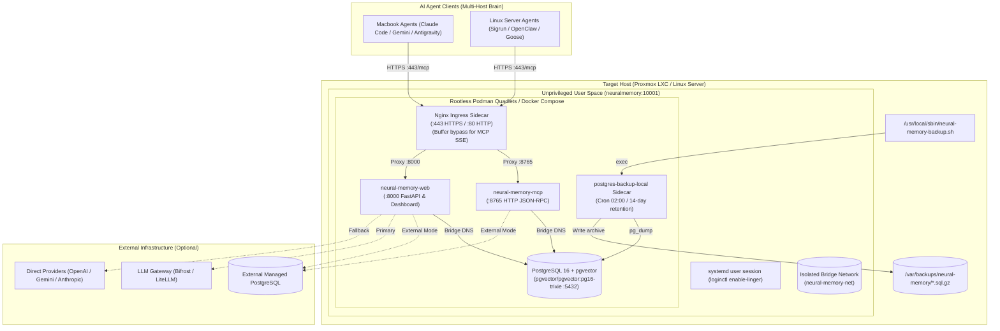

# ansible-role-neural-memory

[](#)
[](LICENSE)
[](#)

Comprehensive Ansible role and playbook collection to deploy and manage [Neural Memory](https://github.com/jnix85/neural-memory-pro) — persistent long-term memory for AI agents (60+ MCP tools, spreading-activation recall, and neuroscience-inspired consolidation).

This role provisions a production-ready container stack supporting **Rootless Podman Quadlets** and **Docker Compose**, backed by **PostgreSQL with `pgvector`** (local or external), secured with a bundled **Nginx Ingress reverse proxy** for local TLS and SSE buffer bypass, integrated with an **LLM Gateway** (such as [Bifrost](https://github.com/maximumpower/bifrost)), and safeguarded by an automated **database backup sidecar**.

---

## Architecture Overview



---

## Features

- **Rootless Podman Quadlets**: Native systemd container supervision (`.container`, `.volume`, `.network`) under dedicated unprivileged user (`neuralmemory`) with lingering enabled.
- **Docker Compose Fallback**: Optional Docker Compose engine mode for legacy environments (`neural_memory_container_engine: docker`).
- **Nginx Ingress with Streaming Support**: Bundled reverse proxy terminating TLS on port 443 with buffer bypass (`proxy_buffering off;`) for persistent MCP JSON-RPC and SSE streams.
- **PostgreSQL + pgvector**: Dual topology supporting local containerized `pgvector/pgvector:pg16-trixie` or connection to external PostgreSQL instances (`neural_memory_postgres_external: true`).
- **Containerized Backup Sidecar**: `prodrigestivill/postgres-backup-local` automated cron backups with rolling retention pruning, coupled with `/usr/local/sbin/neural-memory-backup.sh` CLI wrapper.
- **LLM Gateway (Bifrost) Compatibility**: Out-of-the-box routing of embedding and completion requests through Bifrost with direct provider fallbacks.
- **Client Configuration Generation**: Automatically exports ready-to-paste configurations for Claude Code, Antigravity/Gemini, and OpenClaw.

---

## Architecture Decision Records (ADRs)

Key architectural decisions are documented in [`docs/adr/`](docs/adr/):

- [`ADR-0001: Container Orchestration & Dual Engine Support`](docs/adr/0001-container-orchestration-and-engine.md)
- [`ADR-0002: Dual Database Topology`](docs/adr/0002-database-topology-local-and-external-postgres.md)
- [`ADR-0003: Bundled Nginx Reverse Proxy Sidecar`](docs/adr/0003-ingress-tls-reverse-proxy-sidecar.md)
- [`ADR-0004: Dedicated Backup Sidecar Container`](docs/adr/0004-sidecar-backup-strategy.md)
- [`ADR-0005: Centralized LLM Gateway Routing & Fallbacks`](docs/adr/0005-llm-gateway-routing-and-fallbacks.md)

Domain language and glossary are maintained in [`CONTEXT.md`](CONTEXT.md).

---

## Target Platforms

- **Debian 12 (Bookworm)** (Standard Proxmox LXC template)
- **Debian 13 (Trixie)**
- **Ubuntu 22.04 LTS (Jammy)** / **Ubuntu 24.04 LTS (Noble)**

---

## Directory Layout

```
ansible-role-neural-memory/
├── ansible.cfg                          # Standalone project Ansible settings
├── requirements.yml                     # Required Ansible collections
├── AGENTS.md                            # Context & instructions for AI agents
├── CONTEXT.md                           # Ubiquitous language & domain model
├── README.md                            # Role documentation
├── docs/
│   └── adr/                             # Architecture Decision Records
│       ├── 0001-container-orchestration-and-engine.md
│       ├── 0002-database-topology-local-and-external-postgres.md
│       ├── 0003-ingress-tls-reverse-proxy-sidecar.md
│       ├── 0004-sidecar-backup-strategy.md
│       └── 0005-llm-gateway-routing-and-fallbacks.md
├── inventory/
│   ├── hosts.yml                        # Inventory hosts
│   └── group_vars/
│       ├── all/main.yml                 # Global inventory defaults
│       └── neural_memory_servers/
│           ├── main.yml                 # Group variables
│           └── vault.yml.example        # Example secrets vault
├── playbooks/
│   ├── site.yml                         # Complete deployment playbook
│   ├── deploy.yml                       # Fast application update & restart
│   └── backup.yml                       # Immediate on-demand database backup
└── roles/
    └── neural_memory/
        ├── defaults/main.yml            # Default role variables
        ├── meta/main.yml                # Role metadata & supported platforms
        ├── handlers/main.yml            # Systemd and service restart handlers
        ├── tasks/
        │   ├── main.yml                 # Orchestration entrypoint
        │   ├── prerequisites.yml        # System utilities, Podman, and Docker
        │   ├── directories.yml          # User, lingering, subuid, and SSL dirs
        │   ├── podman.yml               # Podman Quadlets lifecycle & units
        │   ├── docker.yml               # Docker CE & Compose setup
        │   ├── compose.yml              # Docker Compose deployment path
        │   ├── postgres.yml             # pgvector initialization helper
        │   ├── systemd.yml              # Systemd unit installation (Docker path)
        │   ├── backup.yml               # Backup script & timer integration
        │   └── client_configs.yml       # Agent MCP client configuration export
        └── templates/
            ├── nginx.conf.j2            # Nginx Ingress reverse proxy configuration
            ├── docker-compose.yml.j2    # Docker Compose fallback specification
            ├── neural-memory.env.j2     # Container environment file
            ├── postgres-init.sh.j2      # Database & extension init script
            ├── neural-memory-backup.sh.j2 # Backup execution wrapper
            ├── mcp-client-config.json.j2 # Client configuration snippet
            └── quadlets/
                ├── neural-memory.network.j2
                ├── neural-memory-postgres.volume.j2
                ├── neural-memory-postgres.container.j2
                ├── neural-memory-mcp.container.j2
                ├── neural-memory-web.container.j2
                ├── neural-memory-nginx.container.j2
                └── neural-memory-backup.container.j2
```

---

## Role Variables

### Container Engine & Process Supervisor

| Variable | Default | Description |
| :--- | :--- | :--- |
| `neural_memory_container_engine` | `podman` | Container engine: `podman` (rootless Quadlets) or `docker` (Compose) |
| `neural_memory_manage_podman` | `true` | Install Podman, slirp4netns, and shadow utilities |
| `neural_memory_manage_docker` | `false` | Install Docker CE and Compose plugin |
| `neural_memory_user` | `neuralmemory` | Unprivileged system user for rootless containers |
| `neural_memory_group` | `neuralmemory` | Unprivileged system group |
| `neural_memory_user_uid` | `10001` | Dedicated UID for user namespaces |

### Ingress & Transport Security (Nginx Sidecar)

| Variable | Default | Description |
| :--- | :--- | :--- |
| `neural_memory_enable_ingress` | `true` | Enable bundled Nginx reverse proxy sidecar |
| `neural_memory_ingress_image` | `nginx:alpine` | Nginx container image |
| `neural_memory_ingress_http_port` | `80` | HTTP port (redirects to HTTPS) |
| `neural_memory_ingress_https_port` | `443` | HTTPS TLS port |
| `neural_memory_ingress_tls_self_signed` | `true` | Auto-generate self-signed cert if none provided |
| `neural_memory_tls_cert` | `""` | Custom TLS certificate PEM content (via vault) |
| `neural_memory_tls_key` | `""` | Custom TLS private key PEM content (via vault) |

### PostgreSQL & pgvector

| Variable | Default | Description |
| :--- | :--- | :--- |
| `neural_memory_postgres_external` | `false` | Set `true` to use an external PostgreSQL database |
| `neural_memory_postgres_image` | `pgvector/pgvector:pg16-trixie` | PostgreSQL container image with pgvector |
| `neural_memory_postgres_container_name` | `neural-memory-postgres` | PostgreSQL container name |
| `neural_memory_postgres_database` | `neuralmemory` | Target database name |
| `neural_memory_postgres_user` | `neuralmemory` | Database role name |
| `neural_memory_postgres_password` | auto-generated or vault | Database password |
| `neural_memory_embedding_dim` | `1536` | Vector embedding dimension size |

### LLM Gateway & Providers (Bifrost)

| Variable | Default | Description |
| :--- | :--- | :--- |
| `neural_memory_llm_gateway_url` | `""` | Base URL for LLM Gateway (e.g. `http://bifrost.internal:8080/v1`) |
| `neural_memory_llm_gateway_api_key` | `""` | API key for LLM Gateway / Bifrost |
| `neural_memory_llm_gateway_model` | `gpt-4o` | Default chat model used by the gateway |
| `neural_memory_openai_base_url` | `{{ neural_memory_llm_gateway_url }}` | OpenAI base URL endpoint |
| `neural_memory_openai_api_key` | `{{ neural_memory_llm_gateway_api_key }}` | OpenAI API key |
| `neural_memory_gemini_api_key` | `""` | Optional Google Gemini API key |
| `neural_memory_anthropic_api_key` | `""` | Optional Anthropic Claude API key |

### Backup Sidecar

| Variable | Default | Description |
| :--- | :--- | :--- |
| `neural_memory_backup_enabled` | `true` | Enable automated backup sidecar container |
| `neural_memory_backup_image` | `prodrigestivill/postgres-backup-local:16` | Backup sidecar image |
| `neural_memory_backup_cron_schedule` | `0 2 * * *` | Cron schedule expression for backups |
| `neural_memory_backup_retention_days` | `14` | Rolling retention retention period in days |

---

## Quick Start

### 1. Configure Secrets

```bash
cp inventory/group_vars/neural_memory_servers/vault.yml.example inventory/group_vars/neural_memory_servers/vault.yml
ansible-vault encrypt inventory/group_vars/neural_memory_servers/vault.yml
```

### 2. Validate Syntax & Check

```bash
# Validate playbook syntax
ansible-playbook -i inventory/hosts.yml playbooks/site.yml --syntax-check

# Dry-run execution
ansible-playbook -i inventory/hosts.yml playbooks/site.yml --check --diff
```

### 3. Deploy

```bash
ansible-playbook -i inventory/hosts.yml playbooks/site.yml
```

---

## Operational Commands

### Manage Service Units (Podman Quadlets)

```bash
# Check running containers
runuser -u neuralmemory -- podman ps

# Check unit status under user session
runuser -u neuralmemory -- systemctl --user status neural-memory-web.service
runuser -u neuralmemory -- systemctl --user status neural-memory-mcp.service
runuser -u neuralmemory -- systemctl --user status neural-memory-nginx.service

# View container logs
runuser -u neuralmemory -- podman logs -f neural-memory-mcp
```

### Backups

```bash
# Trigger on-demand backup via Ansible
ansible-playbook -i inventory/hosts.yml playbooks/backup.yml

# Or run directly on target host
/usr/local/sbin/neural-memory-backup.sh

# List existing backups
ls -lh /var/backups/neural-memory/
```

### Day-0 Brain Migration & Cold Standby (Kubernetes Cutover)

```bash
# 1. Export verified Brain snapshot (pg_dump -Fc + /data archive)
ansible-playbook -i inventory/hosts.yml playbooks/migrate_brain.yml

# Optional: Fetch artifacts to local ./migration_artifacts/ directory
ansible-playbook -i inventory/hosts.yml playbooks/migrate_brain.yml -e "neural_memory_fetch_artifacts=true"

# 2. Transition host to Cold Standby (freeze services, preserve volumes)
ansible-playbook -i inventory/hosts.yml playbooks/cold_standby.yml

# 3. Generate and distribute Kubernetes MCP client configs
ansible-playbook -i inventory/hosts.yml playbooks/update_k8s_clients.yml
```

---

## License

MIT License. Copyright (c) Jason Parks.
